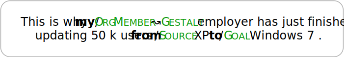

# PASTRIE
[![CC BY-SA 4.0][cc-by-sa-shield]][cc-by-sa]

Official release of the corpus described in the paper:

Michael Kranzlein, Emma Manning, Siyao Peng, Shira Wein, Aryaman Arora, and Nathan Schneider (2020).
**PASTRIE: A Corpus of Prepositions Annotated with Supersense Tags in Reddit International English** [[link](https://www.aclweb.org/anthology/2020.law-1.10/)].
_Proceedings of the 14th Linguistic Annotation Workshop_.

---

## Overview
PASTRIE is a corpus of English data from Reddit annotated with preposition supersenses from the [SNACS inventory](https://arxiv.org/abs/1704.02134).

While the data in PASTRIE is in English, it was produced by presumed speakers of four L1s:
- English
- French
- German
- Spanish

For details on how L1s were identified, see section 3.1 of [Rabinovich et al. (2018)](https://www.aclweb.org/anthology/Q18-1024.pdf).

### Annotation Example
Below is an example sentence from the corpus, where annotation targets are bolded and preposition supersenses are annotated with the notation SceneRole↝Function. Together, a scene role and function are known as a [construal](https://www.aclweb.org/anthology/S17-1022.pdf).

---

## Data Formats
PASTRIE is released in both `.conllulex` and `.json` formats.

See [conllulex documentation](https://github.com/nert-nlp/streusle/blob/master/CONLLULEX.md) for details. Note that PASTRIE does not provide data for every `conllulex` column.

[cc-by-sa]: http://creativecommons.org/licenses/by-sa/4.0/
[cc-by-sa-shield]: https://img.shields.io/badge/License-CC%20BY--SA%204.0-lightgrey.svg
